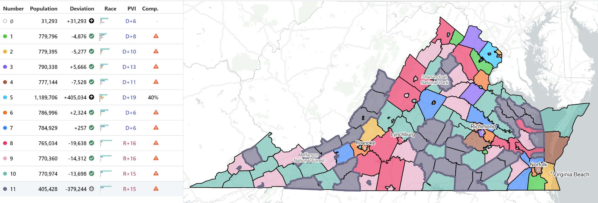
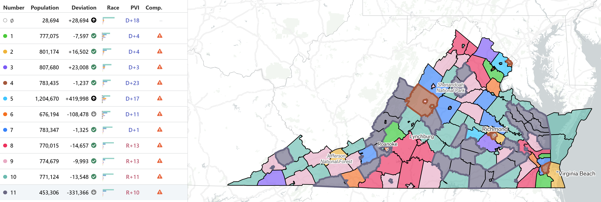

# Summary
The purpose of this lab was to effectively remap the Virginian voting districts whilst still maintaining a variance of 5% in population between the largest and smallest districts in a way that could skew the election results in future elections to favor a certain party. Given this, we came up with our question: Would it be possible to effectively gerrymander Virginia to help either the Republican or Democratic parties consistently win the election given data from the past 5 elections. Our strategy to do this involved using a greedy choice algorithm to combine adjacent counties into voting districts. The algorithm would find a county with the highest percentage of the opposing party’s voters and then find another county with similar distributions. Once it was done with this, it would go through and have the desired party win the district by pretty thin margins. This way, the opposing party would waste a bunch of their votes by winning certain districts in landslides while the desired party would have their votes maximized by only winning by thin margins. This algorithm actually worked pretty well in doing this but had a couple of downfalls, the main one being that it was unable to construct voting districts out of adjacent counties so the voting districts wouldn’t actually be able to be implemented. There were also problems with handling Fairfax County due to the fact that it must be split into more than one district and because of the 3 independent cities that lie within its borders. Besides these limitations, the algorithm produced some pretty good results. The distributions were all valid as the smallest district was within 5% total population as the most populous district. It was also able to gerrymander the districts in a way that would allow for the desired party to have a serious edge in an election. However, due to the fact that the districts aren’t composed of adjacent counties the gerrymandering would not be applicable in a real-world scenario.

# Data
For data wrangling, we decided to create a CSV file that organizes all the counties and independent cities in Virginia. Using the "voting_VA.csv" data, we gathered the number of people who voted for specific candidates and the total number of people who voted for the last six presidential elections. For the 2020 election, the data was broken down into specific types of voting, including absentee, election day, and other. For that election, we combined them into one row. Using the data from every election, we calculated the proportion of votes for each presidential candidate by dividing the number of votes per candidate by the total number of votes for each county. Afterwards, we calculated the average proportion by adding up all the proportions for the six elections and then dividing by 6.
Using the proportions as well as the total population of each county in the 2020 census from “nhgis0002_ts_nominal_county.csv,” we created a CSV that showed the average proportions of each political party (Democrat, Republican, or other) for each county. There was a naming conflict involved with independent cities in the 2020 election, where the data had the word "city" to the end of the names. To address this issue, we decided to include another column using the FIPS number to distinguish all of the counties and cities in Virginia. The new CSV file, called "presidential_party_proportions.csv," will be mainly used in our gerrymandering algorithm. 
The next step was to use the provided “county_adjancencies.csv” file and combine it with the new “presidential_party_proportions.csv” file. We wanted all the counties in Virginia to have their respective neighboring counties in the same row along with the total population and proportion of democratic, republican, and “other” voters. This was a challenging problem because we had to combine all independent cities such as Richmond City into their larger county. Additionally, there were some formatting issues. We had to capitalize all the counties in the “county_adjancencies” spreadsheet to ensure that they matched with our larger spreadsheet. Then we had to go through each county to ensure that the names matched, in “presidential_party_proportions.csv,” “HarrisonburgCity” was listed as “HARRISONBURG.” Additional changes had to be made for “CharlesCty,” “JamesCty,” “KingGeorge,” which were converted to “CHARLES CITY,” “JAMES,” and “KING GEORGE,” respectively. Also, there existed four counties where the share the same name as an independent city in Virginia, Richmond, Roanoke, Fairfax, and Franklin.  To combat duplicates, for only those independent cities we added the word city to the end to distinguish them.  This formatting process was completed in Excel until all the names for all the counties matched and the resulting spreadsheet was titled “counties_with_adjancencies.csv.” Also, due to Fairfax County being larger than the required population for a voting district and to keep the proportionality of each voting district constant, we broke up the county into two, where the population was divided in half, but the proportions of voters in each party was kept the same.


# Results
  We considered a variety of approaches when deciding how we wanted to gerrymander Virginia. To simplify the problem, we decided that we would not break up the districts. We did not realize this at the time, but this “simplification” actually came with its own host of issues. Fairfax county itself is so big (with a population of 1,174,455) that without splitting it up it is larger than the upper bound for the number of people we wanted per district. Furthermore, once Fairfax is effectively its own district, Arlington, Alexandria, and Falls Church must become their own district as well due to the contiguity requirement. This combined district would only have around 413,000 people which is well below the lower bound for the number of people we wanted per district. We decided that we would not respect the contiguous requirement to further simplify the problem and make the project as achievable as possible.
  
	We then decided to use python to implement a greedy algorithm that would start with a set of all the counties and select the county with the highest party population for our desired gerrymandering party. It would then grow the district by adding more counties (from the available set) which shared the same dominant party until it hit the population requirement. 
	
```{python}
county_data = pd.read_csv("counties_with_adjacencies.csv")

graph = nx.Graph()
for idx, row in county_data.iterrows():
   graph.add_node(row['county'], population=row['totalpopulation'], democrat=row['democrat'], republican=row['republican'], other=row['other'])
   neighbors = row[5:].dropna().values
   for neighbor in neighbors:
       graph.add_edge(row['county'], neighbor)
```

	First we set up a network of all the counties, their proportions for voting preference, and their neighbors as outlined in the “counties_with_adjacencies.csv” spreadsheet.
	
```{python}
def grow_district(graph, start_county, target_population_range, party):
   current_population = graph.nodes[start_county]['population']
   district = [start_county]
   candidates = list(graph.neighbors(start_county))
   while current_population < target_population_range[0]:
       if not candidates:
           break
       # Choose the county that maximizes the targeted party votes
       candidate = max(candidates, key=lambda x: graph.nodes[x][party])
       candidates.remove(candidate)
       current_population += graph.nodes[candidate]['population']
       district.append(candidate)
       candidates.extend([n for n in graph.neighbors(candidate) if n not in district])
   return district, current_population
```

While this logic was not perfect due to outlier counties such as Fairfax, the algorithm actually performed quite well especially for democratic gerrymandering. The population ranges were respected outside of the outlier counties and every county was picked exactly once until the remaining set of available counties was empty. The gerrymandering function is shown below:

```{python}
def gerrymander(graph, districts, target_population_range, max_targeted_districts, party):
   result = defaultdict(list)
   unassigned_counties = set(graph.nodes)

   for i in range(1, districts + 1):
       if not unassigned_counties:
           break

       if i <= max_targeted_districts:
           starting_county = max(unassigned_counties, key=lambda x: graph.nodes[x][party])
       else:
           starting_county = min(unassigned_counties, key=lambda x: graph.nodes[x][party])

       result[i].append(starting_county)
       unassigned_counties.remove(starting_county)
       district_population = graph.nodes[starting_county]['population']

       while district_population < target_population_range[0] and unassigned_counties:
           next_county = None
           min_diff = float('inf')

           for county in unassigned_counties:
               new_population = district_population + graph.nodes[county]['population']
               if target_population_range[0] <= new_population <= target_population_range[1]:
                   next_county = county
                   break

               diff = abs(new_population - target_population_range[0])
               if diff < min_diff:
                   min_diff = diff
                   next_county = county

           if next_county:
               result[i].append(next_county)
               unassigned_counties.remove(next_county)
               district_population += graph.nodes[next_county]['population']
           else:
               break

   return result
```
	
		The resulting districts, the counties within them, and the new proportion of democratic, republican, and “other” voters were outlined using the code below: 
		
```{python}
def calculate_new_proportions(district, graph):
   total_democrat_votes = 0
   total_republican_votes = 0
   total_other_votes = 0
   total_population = 0

   for county in district:
       county_data = graph.nodes[county]
       total_democrat_votes += county_data['population'] * county_data['democrat']
       total_republican_votes += county_data['population'] * county_data['republican']
       total_other_votes += county_data['population'] * county_data['other']
       total_population += county_data['population']

   if total_population != 0:
       new_democrat = total_democrat_votes / total_population
       new_republican = total_republican_votes / total_population
       new_other = total_other_votes / total_population
   else:
       new_democrat = 0
       new_republican = 0
       new_other = 0
   return new_democrat, new_republican, new_other, total_population

for i, district in enumerate(districts_counties_republican, start=1):
   new_democrat, new_republican, new_other, total_population = calculate_new_proportions(district, graph)
   print(f"District {i}:")
   print(f"  Counties: {', '.join(district)}")
   print(f"  Democrat proportion: {new_democrat:.2%}")
   print(f"  Republican proportion: {new_republican:.2%}")
   print(f"  Other proportion: {new_other:.2%}")
   print(f"  Total population: {total_population}")
   print()

for i, district in enumerate(districts_counties_democrat, start=1):
   new_democrat, new_republican, new_other, total_population = calculate_new_proportions(district, graph)
   print(f"District {i}:")
   print(f"  Counties: {', '.join(district)}")
   print(f"  Democrat proportion: {new_democrat:.2%}")
   print(f"  Republican proportion: {new_republican:.2%}")
   print(f"  Other proportion: {new_other:.2%}")
   print(f"  Total population: {total_population}")
   print()
```
		
		The next step was to predict the voting outcomes in our new districts. Based on our new districts, we were able to gerrymander the voting districts to favor either the Republican party or the Democratic party. In our first gerrymandering process, the algorithm executed to favor the Democratic party by picking the county with the highest population and then adding counties together so that the Democratic party benefitted the most. By favoring the Democrats, the volume weighted average of our algorithm had the Democratic party winning the majority in 7 out of 11 districts based on the new gerrymandered districts. Below is the volume weighted average of the proportions and how they were distributed between districts. 
		
```{r}
democrat_gerrymander = data.frame(
  District = c(1, 2, 3, 4, 5, 6, 7, 8, 9, 10, 11),
  Counties = c("PETERSBURG, PRINCE WILLIAM, CHESAPEAKE, CLARKE",
               "CHARLOTTESVILLE, VIRGINIA BEACH, ARLINGTON, BOTETOURT",
               "RICHMOND, LOUDOUN, SPOTSYLVANIA",
               "ALEXANDRIA, CHESTERFIELD, NORFOLK, NORTHAMPTON",
               "FALLS CHURCH, FAIRFAX",
               "PORTSMOUTH, HENRICO, ROANOKE, STAFFORD",
               "HAMPTON, NEWPORT NEWS, ALBEMARLE, HANOVER, MONTGOMERY, SUFFOLK, MANASSAS",
               "CHARLES CITY, FREDERICK, ROCKINGHAM, BEDFORD, LYNCHBURG, JAMES CITY, AUGUSTA, FAUQUIER, YORK, FRANKLIN, PITTSYLVANIA, MIDDLESEX",
               "WILLIAMSBURG, CAMPBELL, WASHINGTON, CULPEPER, HARRISONBURG, HENRY, SHENANDOAH, PRINCE GEORGE, DANVILLE, WARREN, TAZEWELL, GLOUCESTER, ISLE OF WIGHT, LOUISA, ORANGE, WISE, HALIFAX, PULASKI, STAUNTON",
               "EMPORIA, ACCOMACK, AMHERST, CAROLINE, POWHATAN, MECKLENBURG, SMYTH, CARROLL, WYTHE, WINCHESTER, FREDERICKSBURG, DINWIDDIE, FLUVANNA, KING GEORGE, RUSSELL, SALEM, GOOCHLAND, PAGE, HOPEWELL, NEW KENT, ROCKBRIDGE, WAYNESBORO, LEE, PRINCE EDWARD, SCOTT, GREENE, BUCHANAN, WESTMORELAND, COLONIAL HEIGHTS, SOUTHAMPTON, KING WILLIAM, NELSON",
               "LEXINGTON, PATRICK, BRISTOL, MANASSAS PARK, BUCKINGHAM, GILES, APPOMATTOX, RADFORD, BRUNSWICK, NOTTOWAY, FLOYD, GRAYSON, ALLEGHANY, DICKENSON, MADISON, MARTINSVILLE, AMELIA, POQUOSON, LUNENBURG, NORTHUMBERLAND, CHARLOTTE, GREENSVILLE, LANCASTER, SUSSEX, ESSEX, CUMBERLAND, MATHEWS, RAPPAHANNOCK, GALAX, BUENA VISTA, KING AND QUEEN, SURRY, BLAND, COVINGTON, CRAIG, BATH, NORTON, HIGHLAND"),
  Democrat_proportion = c(53.31, 54.56, 56.60, 56.81, 59.24, 54.00, 53.35, 34.81, 38.48, 39.26, 41.72),
  Republican_proportion = c(44.53, 42.64, 40.89, 40.85, 38.11, 43.73, 44.23, 62.75, 59.24, 58.58, 56.22),
  Other_proportion = c(2.16, 2.80, 2.51, 2.33, 2.66, 2.27, 2.42, 2.44, 2.28, 2.16, 2.06),
  Total_population = c(779867.0, 778262.0, 796524.0, 774302.0, 1189113.0, 786171.0, 782586.0, 772961.0, 772181.0, 771411.0, 428015.00)
)
democrat_gerrymander



```
		
		
```{r}
republican_gerrymander = data.frame(
District = c(1, 2, 3, 4, 5, 6, 7, 8, 9, 10, 11),
Counties = c("POQUOSON, PRINCE WILLIAM, CHESAPEAKE, BOTETOURT",
"BLAND, VIRGINIA BEACH, HENRICO",
"SCOTT, LOUDOUN, CHESTERFIELD",
"AUGUSTA, ARLINGTON, NORFOLK, RICHMOND",
"POWHATAN, FAIRFAX",
"CARROLL, ROANOKE, NEWPORT NEWS, ALEXANDRIA, STAFFORD, MANASSAS",
"ROCKINGHAM, SPOTSYLVANIA, HAMPTON, ALBEMARLE, HANOVER, MONTGOMERY, PORTSMOUTH",
"PATRICK, SUFFOLK, FREDERICK, BEDFORD, LYNCHBURG, JAMES CITY, FAUQUIER, YORK, FRANKLIN, PITTSYLVANIA, CAMPBELL, CLARKE",
"WYTHE, WASHINGTON, CULPEPER, HARRISONBURG, HENRY, CHARLOTTESVILLE, SHENANDOAH, PRINCE GEORGE, DANVILLE, WARREN, TAZEWELL, GLOUCESTER, ISLE OF WIGHT, LOUISA, ORANGE, WISE, HALIFAX, PULASKI, STAUNTON",
"COLONIAL HEIGHTS, PETERSBURG, ACCOMACK, AMHERST, CAROLINE, MECKLENBURG, SMYTH, WINCHESTER, FREDERICKSBURG, DINWIDDIE, FLUVANNA, KING GEORGE, RUSSELL, SALEM, GOOCHLAND, PAGE, HOPEWELL, NEW KENT, ROCKBRIDGE, WAYNESBORO, LEE, PRINCE EDWARD, GREENE, BUCHANAN, WESTMORELAND, SOUTHAMPTON, KING WILLIAM, BRISTOL, MANASSAS PARK, BUCKINGHAM, GILES, APPOMATTOX, NORTHAMPTON",
"CRAIG, RADFORD, BRUNSWICK, NOTTOWAY, FLOYD, WILLIAMSBURG, GRAYSON, ALLEGHANY, NELSON, FALLS CHURCH, DICKENSON, MADISON, MARTINSVILLE, AMELIA, LUNENBURG, NORTHUMBERLAND, CHARLOTTE, GREENSVILLE, LANCASTER, SUSSEX, MIDDLESEX, ESSEX, CUMBERLAND, MATHEWS, RAPPAHANNOCK, LEXINGTON, CHARLES CITY, GALAX, BUENA VISTA, KING AND QUEEN, SURRY, EMPORIA, COVINGTON, BATH, NORTON, HIGHLAND"),
Democrat_proportion = c(50.65, 48.83, 46.98, 66.90, 58.30, 56.43, 48.60, 38.10, 40.53, 43.01, 46.23),
Republican_proportion = c(47.17, 48.81, 50.73, 30.34, 39.07, 41.08, 48.95, 59.55, 57.10, 54.86, 51.65),
Other_proportion = c(2.19, 2.36, 2.29, 2.76, 2.63, 2.48, 2.45, 2.34, 2.36, 2.14, 2.12),
Total_population = c(777682, 800129, 807083, 789668, 1204788, 771508, 780947, 776730, 775903, 771424, 375531)
)

republican_gerrymander


```
		
		
#Conclusion

	